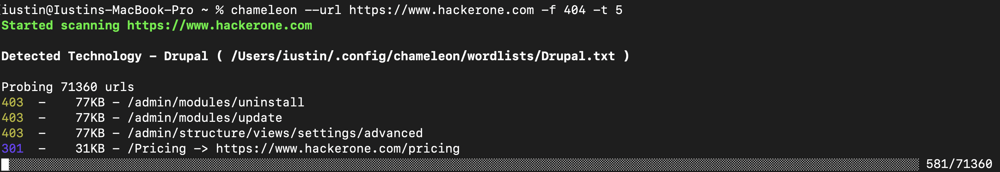
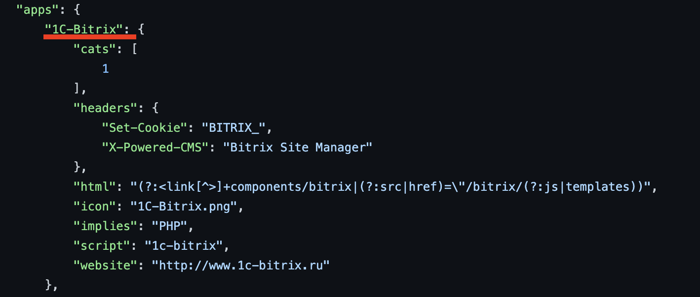

# Chameleon 

Chameleon provides better content discovery by using wappalyzer's set of technology fingerprints alongside custom wordlists tailored to each detected technologies.

The tool is highly customizable and allows users to add in their own custom wordlits, extensions or fingerprints.

## Installation

### Step 1:

Visit https://rustup.rs/ and follow the instructions to get started with rust and cargo.

### Step 2: 

```
> cargo install https://github.com/iustin24/chameleon
```
Installing the crate will create the directory `~/.config/chameleon/` and download the config file and custom wordlists.

### Step 3:

If you do not have (headless) chrome installed already, you will need to install (headless) chrome otherwise you will get the following error:
`Could not auto detect a chrome executable`

## Example Usage:

### Basic Directory Bruteforce:
```
> chameleon --url https://example.com/ -w /path/to/wordlist -f 404
```

<p align="center">
  
</p>

### Options

```
OPTIONS:
    -c, --config <CONFIG>
            Config file to use [default: ~/.config/chameleon/config.toml]

    -f, --fc <FILTERCODE>
            Filter HTTP status codes from response - Comma separated list [default: 404]

    -h, --help
            Print help information

    -S, --fs <FILTERSIZE>
            Filter HTTP response size. Comma separated list of sizes and ranges

    -t, --concurrency <CONCURRENCY>
            Number of concurrent threads ( default: 200 ) [default: 200]

    -T, --tech url <TECH_URL>
            URL which will be scanned for technologies. By default, the url from  '-u' is used,
            however it can be changed using '-T'

    -u, --url <URL>
            url to scan

    -V, --version
            Print version information

    -w, --wordlist <WORDLIST>
            Main wordlist to use for bruteforcing

    -W, --small wordlist <SMALL_WORDLIST>
            Wordlist used to generate files by adding extensions ( FUZZ.%ext )
```

## Config file

Chameleon uses the config file located in `~/.config/chameleon/config.yaml`. 

### Changing the default wordlists:

If no wordlist is provided, chameleon will use the wordlist specified in `main_wordlist` from the config file. ( Default: ~/.config/chameleon/wordlists/raft-medium-words.txt )

When detecting technologies with characteristic extensions, chameleon will generate a wordlist by like so ( FUZZ.%ext ). Chameleon will use the wordlist specified in `small_wordlist` from the config file. ( Default: ~/.config/chameleon/wordlists/raft-medium-words.txt )

### Changing technology wordlists

Example config.yaml with technology specific wordlists:

```
# Technology Specific Wordlists:

Flask="~/.config/chameleon/wordlists/Flask.txt"
Java="~/.config/chameleon/wordlists/Java.txt"
Go="~/.config/chameleon/wordlists/GO.txt"
...
```

### Adding new technology wordlists

Chameleon uses fingerprints from https://github.com/iustin24/wappalyzer/blob/master/apps.json. 
You can add new technology wordlists by taking the name of a technology from `apps.json` and adding it to the config file like so:

<p align="center">
  
</p>

```
# Technology Specific Wordlists:

1C-Bitrix="~/.config/chameleon/wordlists/new_tech_wordlist.txt"
...
```


## To-do

Update the wappalyzer crate to also support the "implies" feature for better technology detection.
